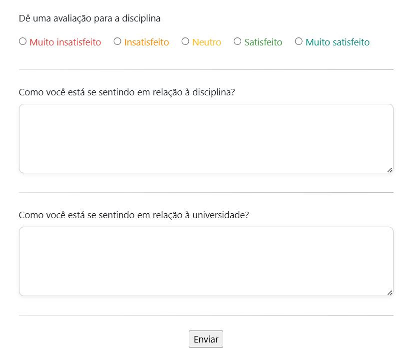
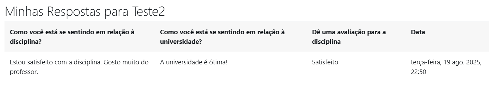
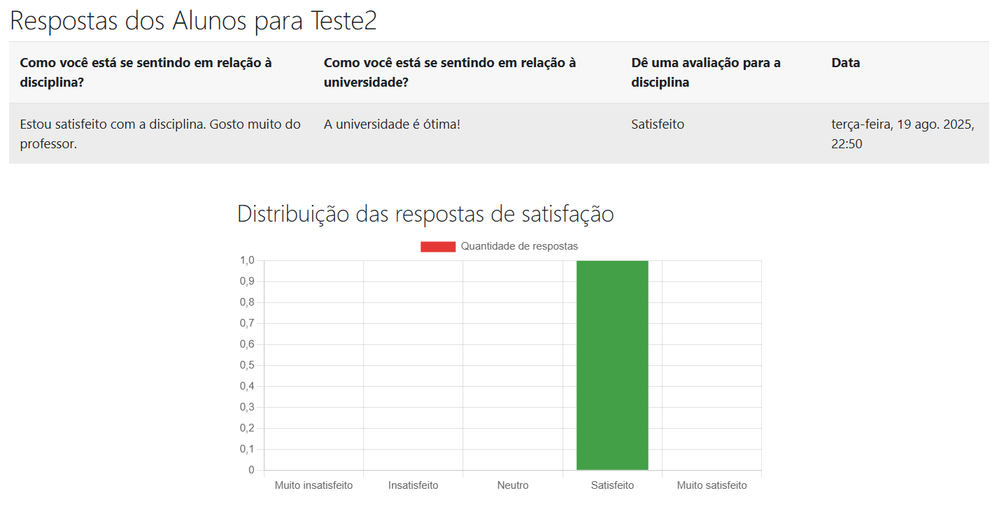

# EduPulse - Moodle Sentiment Questionnaire

## Overview

EduPulse is a Moodle module designed to gather student sentiment and feedback within a course. It allows students to respond to questions about their feelings regarding the course and the university, as well as provide an overall satisfaction rating. This feedback can be valuable for instructors to understand student perceptions and make improvements to the course.

## Features

* **Sentiment Collection:** Gathers student sentiment through open-ended questions and a satisfaction rating.
* **Satisfaction Scale:** Provides a Likert scale for students to rate their satisfaction level.
* **Data Visualization:** Displays a chart summarizing the distribution of satisfaction ratings.
* **Instructor Access:** Allows instructors to view individual student responses and the overall satisfaction distribution.
* **Student Access:** Allows students to view their own responses.
* **Completion Tracking:** Supports Moodle's completion tracking, allowing activities to be marked as complete upon submission.
* **Multilingual Support:** Uses Moodle's language string system for easy translation.

## Installation

1.  Copy the `edupulse` folder to the `mod` directory of your Moodle installation (`/mod/edupulse`).
2.  Log in to your Moodle site as an administrator.
3.  Go to `Site administration > Notifications` to trigger the plugin installation.
4.  Follow the on-screen instructions to complete the installation.

## Configuration

1.  After installation, add an "EduPulse" activity to your course.
2.  Configure the activity settings, including:
    * **Name:** The title of the questionnaire.
    * **Introduction:** A description of the questionnaire's purpose.
    * **Questions:** The questions you want students to answer.
    * **Completion Tracking:** Enable completion tracking based on student responses.

## Usage

1.  Students access the EduPulse activity within their course.

### Student Sentiment Registration Screen

2.  They answer the questions and select a satisfaction rating.

### Student Response View Screen

3.  Students can view their own responses after submission.
4.  Instructors can view all student responses and a summary chart.

### Instructor Dashboard

## Dependencies

* Moodle 4.0 or later
* Chart.js (included via CDN)

## Contributing

Contributions are welcome! Please submit pull requests with bug fixes, new features, or improvements to the documentation.

## License

This Moodle module is licensed under the GNU General Public License v3 or later. See the `LICENSE` file for details.

## Version

1.  0 (Release Date: August 8, 2025)

## Credits

* Developed by Benjamin Grando Moreira